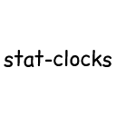

# **Stat Clocks**
A Minecraft mod that adds a way to track how you use your tools.
---
 

## Installation:
- Install Fabric by following the [Fabric Installation Guide](https://wiki.fabricmc.net/install).
- Download the latest version of Stat Clocks from the [releases page](https://github.com/OrcaCrafter/StatClocks/releases).
- Place the **`stat-clocks.jar`** file into the **`mods`** folder of your Fabric installation.

 

## License:
<!--TODO decide license Stat Clocks is distributed under the [GNU General Public License v3.0]().-->

 

## Disclaimer:
Stat Clocks is not affiliated with, approved by, or associated with Mojang Studios or Microsoft. Minecraft is a registered trademark of Mojang Studios. Use of the Stat Clocks software is subject to the terms listed in the [**license agreement**]().
